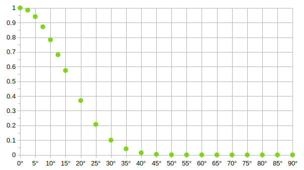

# focus-next
Raise and focus the closest window in *left* | *up* | *right* or *down* direction.

Currently works only on x11 desktops.

Use it from commandline as follows:  
`node focus-next.js DIRECTION`  
Where DIRECTION is one of:
* left, up, right, down
* left-up, left-down, right-up, right-down

(mind the lower case!)

Future:
* stack (switch between a stack of overlappiing windows nearby)
* raiseall (raise all minimized windows, somehow this is not natively possible in my distro)


# idea
Instead of the annoying `Alt + Tab` way of cycling through a sequential list 
that depicts all open windows, I rather want to have a shortcut that 
allows me to interact with the windows I actually see on my screen. 

So the big idea is:  

> Manage and focus windows you actually see.  

Or stating the purpose in a more negative way:  

> Do not divert the users attention from what can be seen on 
> screen, to a sequential list of items that need to be
> mapped to the actual windows. 

## focussing mechanics
So for a new way of setting focus to a window I needed to define the mechanics of how to focus 
the next window. The guiding principles for this are: 
* It must **feel intuitive**
* Is based on **what you actually see**

These principles are implemented by the following...

### directives:

**filter**  
Always filter potential focus candidate windows by the direction given by the user (via arrow keys or other shortcuts) and sort out all windows that are in a direction that is more than ±90° away. So the command `focus-next right` 
will never select a window to the left of the current focused window, 
even if there is no other window on the right side.

An addition filter is:
* If a window is minimized: don't focus (or even raise) it, because it was intentionally hidden by the user.

**proximity**  
The user defines the focus in relation to the current window where probably also his/her current focus sits. So all candidate windows for the next focus are sorted by their distance to the current focused window.

**weighting**  
Prioritize to focus windows that are positioned along the focus direction to honor the users wish for setting a focus in that direction. 
So even if a window is closest, but is about 45° (or more) away from the choosen direction, it should not be selected. Instead more distanced windows but within a closer angle range (ideally 0° - 30°) should be selected.

In the example depicted below, window **A** is focused and `focus-next right` is called. In this case we want 
explicitly to focus **C** and **not B**. 

The reason is: C is close to 0° in right-direction from A. Window B on the other hand deviates about 45° from the right direction and thus gets a lower prio. 
```
(user: 'focus-next right')
╔═══╗*                           ┏━━━┓ ?
║ A ║  --►                       ┃ C ┃
╚═══╝                            ┗━━━┛
             ┏━━━┓ ?          
             ┃ B ┃           
             ┗━━━┛       
         
        
 ┏━━━┓ 
 ┃ D ┃
 ┗━━━┛        
         
```

To implement this we simply give a higher weight to candidate windows that are closer to the direction that the user defined. If a candidate windows center point can be reached by 0° deviation from the direction the user specified, it gets a weight of 1. At angles of about 45° the wieght is almost 0.



*x-axis* shows the deviation angle in degree (of a potential focus candidate)  
*y-axis* show the resulting weight  


**weighting problem**  

If **A** is focused, `focus-next right` should focus **C** next instead of **B**. 
However, this might lead to a problem: if the user now actually wants to focus 
**B**, it might not be possible: in 'right' direction **C** would be selected 
and in 'down' direction **D** would be selected (Because in both cases another
window has a better angle). To handle this scenario, the diagonal selection 
with a combination of two arrows would be needed.

This is something difficult: an OS shortcut is normally not able to handle two
arrows in a combination... so focus-next needs to handle these scenarios: if 
within 300 msec a second call to focus-next in a different direction is 
triggered, the diagonal mode is started and the first call removed.

**overlapping windows**  
If a window can't be seen (behind other windows) make it possible to focus,
but with last priority to other windows, because the user probably wants to 
select something else that he/she can actually see.
* The previous point might introduce problems if a user actually wants to be
able to focus all available windows, or investigate all the windows that are stacked
above eachother. In such a case one should be able switch through a roghtly overlapping
stack of windows with a distinct command.


# 'installation'
Package dependencies are (on ubuntu 20)
* **xdotool**
* **x11-utils** (or only: xwininfo), on fedore this package is called: `xorg-x11-utils`
* **nodejs** (tested with version 14, but lower versions might work as well)

Simply bind global shortcuts commands like this:
> Meta + Alt + LeftArrow => `node /path/to/focus-next.js left`  
> Meta + Alt + RightArrow => `node /path/to/focus-next.js right`  


# outlook
This is currently just a prototype to test different selection methods
in order to make something more rounded and user friendly. 

In future it would be very nice to support different linux (x11 and wayland) 
desktops and windows as well. However: I will never try target MacOS (sorry).

If this project is continued, I would like to have a simple installer or
package and make the tool easily configurable. Perhaps even with a **tiny** UI 
for configuration or even visual feedback.

...but for now I can only say:
```
happy fiddling ;-)
```